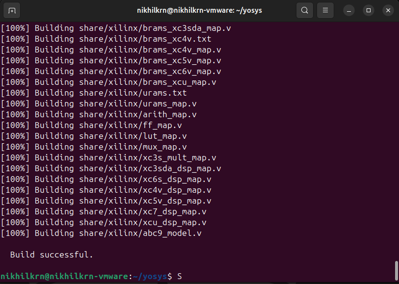
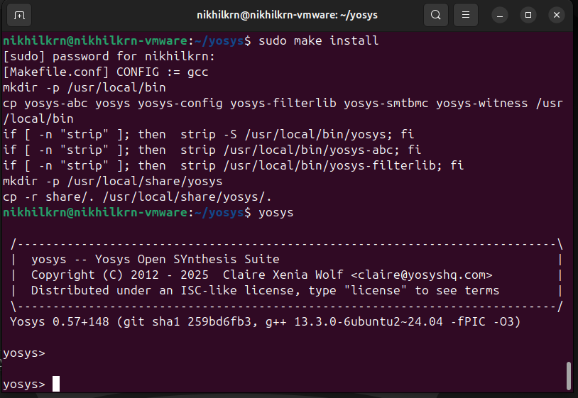
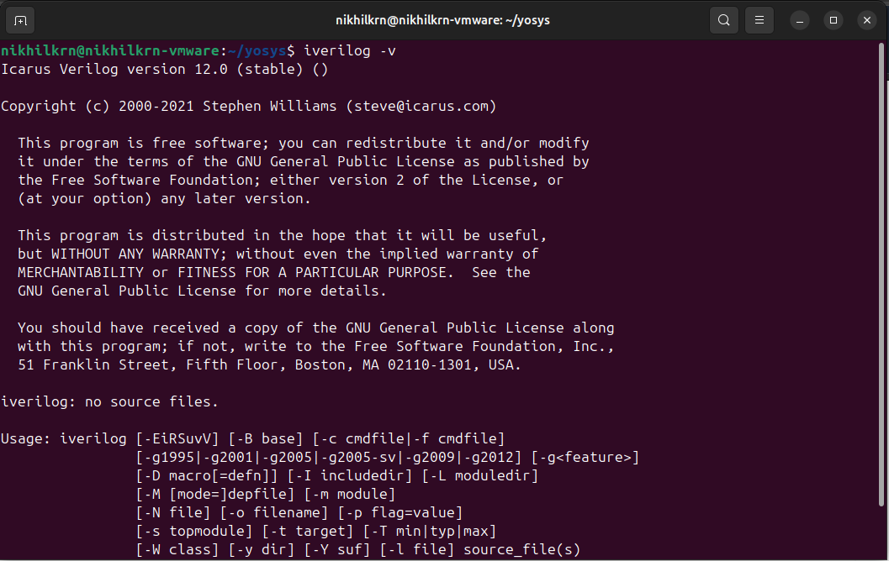
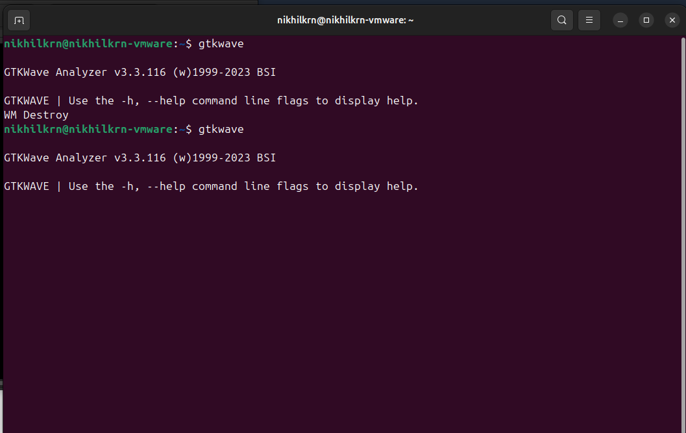
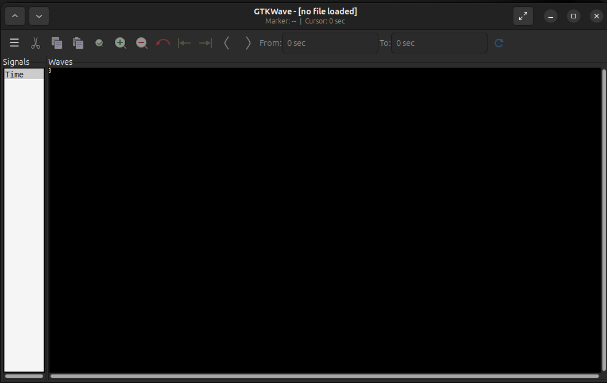

# Day 0 / Lab 0 – Environment Setup & Tool Installation ⚙️

This document covers the **initial setup** for the RISC-V SoC Tapeout Program. Before starting the labs, we need to set up a Linux environment and install the open-source EDA tools that will be used throughout the course.

---

## 🖥️ System Requirements
- **OS**: Ubuntu 20.04 or later (64-bit)
- **RAM**: Minimum 6 GB
- **Storage**: At least 50 GB free
- **CPU**: 4 vCPUs recommended

If you are on Windows/Mac, use **Oracle VirtualBox or VMware** to create an Ubuntu VM.

- Download VirtualBox: [VirtualBox Downloads](https://www.virtualbox.org/wiki/Downloads)
- Download VMware: [VMware Downloads](https://www.vmware.com/products/desktop-hypervisor/workstation-and-fusion)

---

## 🛠️ Tools to Install
We will install the following open-source tools:
- **Yosys** → Logic synthesis
- **Icarus Verilog (iverilog)** → RTL simulation
- **GTKWave** → Waveform viewer
---

## 📦 Installation Steps

### 1. Update System
- update the system's package database and install the available updates.
```bash
sudo apt-get update
sudo apt-get upgrade
```

### 2. Yosys
- Yosys is a framework for Verilog RTL synthesis.
### ⬇️ Installation guide
- Before installing **Yosys** make sure that you have git installed in you ubuntu system. To install git you can run this command.
```bash
sudo apt install git
```
- you can check if git is installed or not using command
```bash
git --version
```
- if you already have git then run command
```bash
git clone https://github.com/YosysHQ/yosys.git
```
- go to yosys directory
```bash
cd yosys
```
- if you don't have make installed in your system then install make
```bash
 sudo apt install make 
```
- run this command
```bash
sudo apt install make build-essential clang bison flex \
    libreadline-dev gawk tcl-dev libffi-dev git \
    graphviz xdot pkg-config python3 libboost-system-dev \
    libboost-python-dev libboost-filesystem-dev zlib1g-dev
```
- This step might take some time. 
```bash
make config-gcc
make
sudo make install
```

<br>



- check if yosys is installed
```bash
yosys -v
```
<br>



In case of facing difficulty can refer to [yosys documentation](https://github.com/YosysHQ/yosys)


---
### 3. Icarus Verilog
Icarus Verilog (iverilog) is an open-source Verilog simulation and synthesis tool. It allows to compile and run Verilog code (your RTL + testbench) and then see how your design behaves.
### ⬇️ Installation guide
- Run this command to install iverilog.
```bash
sudo apt-get install iverilog
```
- To verify the installation
```bash
iverilog -v
```
<br>



In case of facing any difficulty can follow the [documentaion](https://github.com/steveicarus/iverilog).

---

### 4. GTKWave
GTKWave is an open-source waveform viewer. It helps to visualize simulation results (signal waveforms over time) that is generated using simulators like Icarus Verilog .

### ⬇️ Installation guide
- To install **GTKWave**

```bash
sudo apt install gtkwave
```

- To verify installation
```bash
gtkwave
```
- Command terminal output



- GUI



---

## 📚 References
- [GTKWave](http://gtkwave.sourceforge.net/)
- [Yosys](https://yosyshq.net/yosys/)
- [Iverilog](https://github.com/steveicarus/iverilog)

---

## 📝 Summary
In this lab, we:
- Set up a **Linux/Ubuntu environment**
- Installed core tools: **Yosys, Icarus Verilog, GTKWave**
- Verified installation using version checks

